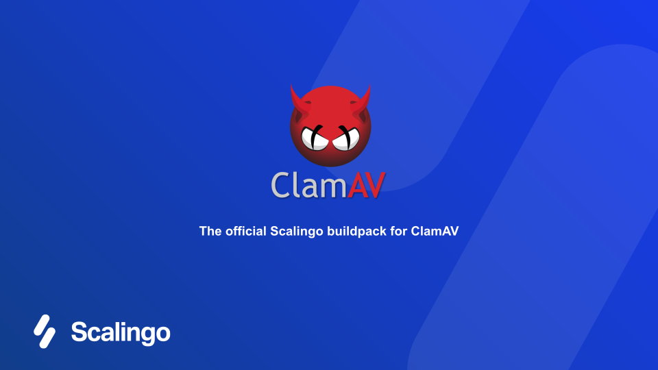

# ClamAV buildpack

This buildpack installs ClamAV into a Scalingo app image.

> :warning: **This buildpack is not meant to be use as a standalone but rather in a
multi-buildpack deployment scenario, along with other softwares** such as nginx
(as front) and clammit (as link between nginx and ClamAV).

> :warning: Please read the instructions provided in the
[Memory Consumption](#memory-consumption) section of this page.

## Usage

The following instructions should help you get started:

1. In your project root, create a file named `.buildpacks` with the following
content:

```
https://github.com/Scalingo/clamav-buildpack.git
# Probably more buildpacks here. Otherwise your container won't boot!
```

2. Setup your other buildpacks. Make sure the software(s) interacting with
ClamAV do it through the local unix socket on which clamd is listening
(`/app/run/clamd.sock`).

3. Make sure your start the other processes that will communicate with ClamAV.
   You may need a `Procfile` to do this.

4. Trigger your deployment.

### Deployment workflow

During the build phase, this buildpack:

1. Downloads and installs the `clamav`, `clamav-daemon` and `clamav-freshclam`
   packages.
2. Creates configuration file for `clamd` in`/app/clamav/clamd.conf`.
3. Creates configuration file for `freshclam` in `/app/clamav/freshclam.conf`.
4. Downloads the latest virus database and stores it in the build cache for
   future use.
5. Copies the virus database to the build directory.

:tada: This process results into a scalable image that includes the
configuration, ready to be packaged into a container.

### Behaviour

The default configuration ensures that:

- `clamd` will run in background.
- `clamd` will listen on a local unix socket (`/app/run/clamd.sock`).
- `freshclam` will run in background, checking for updates 12 times a day,
  unless specified otherwise (see [Environment](#environment) below).
- `freshclam` will use the default `database.clamav.net` mirror, unless
  specified otherwise (see [Environment](#environment) below).

#### Memory consumption

`clamd` requires quite a lot of RAM because it loads the complete virus
definition database into memory. This allows it to be fast.

During a database reload, `clamd`'s default behavior is to temporarily start a
second scanning engine while scanning continues using the first engine. New
scans are handled by the second engine, while the first one finishes its tasks.
The first engine is removed as soon as all its scans have completed.

Consequently, when a database reload occurs, `clamd` uses roughly twice as much
memory as during nominal operations because 2 databases are loaded at the same
time. That's why **we recommend to use a 2XL container for your application**.

You can however disable this behavior by setting the
`CLAMD_DISABLE_CONCURRENT_RELOAD` environment variable
[see below](#CLAMD_DISABLE_CONCURRENT_RELOAD). This should allow you to go with
an XL container. The counterpart is that **scans will be blocked during each
database reload.**

### Environment

The following environment variables are available for you to tweak your
deployment:

#### `CLAMD_DATABASE_MIRROR`

ClamAV database mirror to use.\
Defaults to `database.clamav.net`

#### `CLAMD_DISABLE_DAEMON`

When set, this environment variable instructs the image to **NOT** start the
`clamd` daemon.\
Defaults to being unset

#### `CLAMD_DISABLE_CONCURRENT_RELOAD`

When set, this environment variable instructs `clamd` to disable its
`ConcurrentDatabaseReload` feature. This allows for lower RAM requirements, at
the expense of blocking scans during database reloads (see
[Memory Consumption](#memory-consumption) for further details).\
Defaults to being unset

#### `FRESHCLAM_DISABLE_DAEMON`

When set, this environment variable instructs the image to **NOT** start the
`freshclam` daemon.\
Defaults to being unset

:warning: This is a security risk! Running with an outdated virus database is
pretty useless. You probably don't want to set this, unless you really know
what you do.

:point_right: The virus database is downloaded during the build phase, even
when this environment variable is set.
